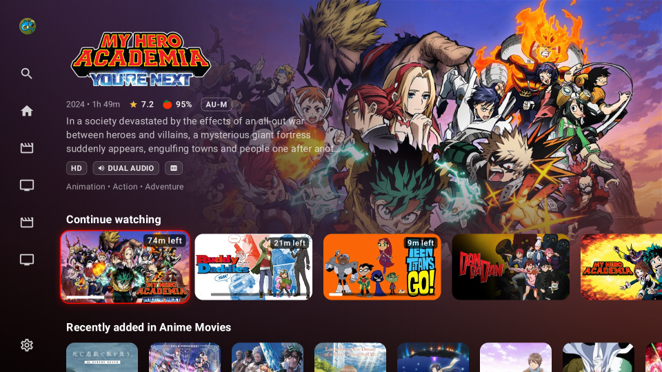
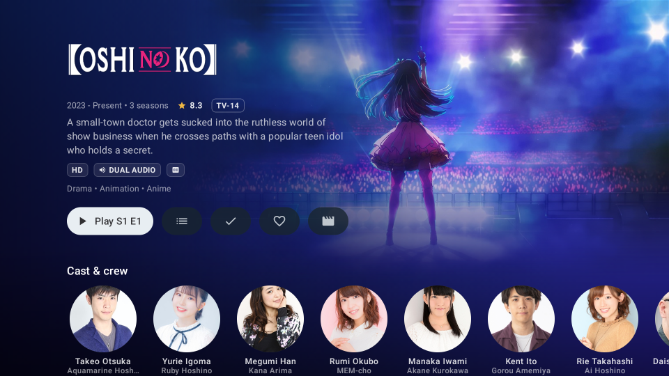
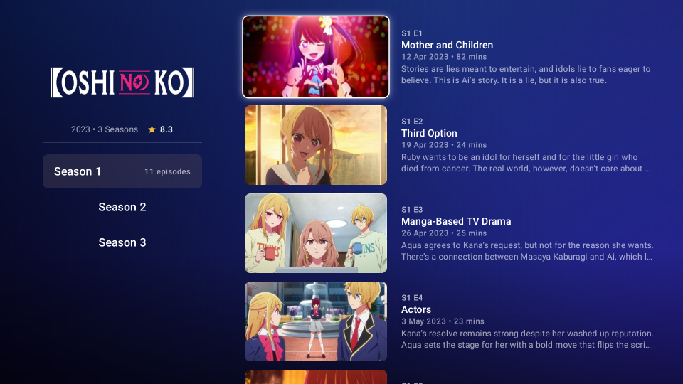
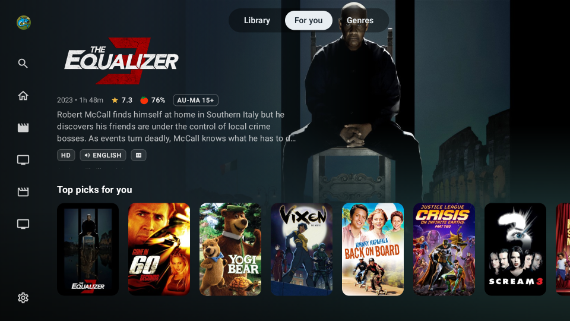

  

<h1 align="center">Picnic Player</h1>

<strong>Native Android TV client for Jellyfin</strong>

  Picnic Player is a native Jellyfin client built for Android TV. It has been
  designed to present your media in an immersive and intuitive way, so
  non-technical people can pick it up and begin using it like they would any
  other streaming app.

## AI Usage
AI is used heavily in the development of this client. This is slop.

## Features

### All the usual suspects including, but not limited to

- Quick Connect
- Multi-user support
- Multi-server support
- Direct play where possible, including libass support in media3 for stylized subtitles
- Refresh rate matching and resolution matching
- Media segments for skipping intros/outros
- Theme music
- Seerr integration

### Plus some extra goodies

- Picture-in-Picture (on supported devices)
- Choose your preferred app for opening external trailers

## Screenshots

<table>
  <tr>
    <td align="center">
       
      <em>Home</em>
    </td>
    <td align="center">
       
      <em>Series details</em>
    </td>
  </tr>
  <tr>
    <td align="center">
       
      <em>Episode listing</em>
    </td>
    <td align="center">
       
      <em>For you</em>
    </td>
  </tr>
</table>

## Acknowledgements

* Shoutout to the Jellyfin team for everything they do and provide for the community
* Shoutout to the wider Jellyfin community and contributors, especially the client devs who help showcase the very best Jellyfin has to offer

## License

Picnic Player is free software under the [GNU GPLv3](./LICENSE).
